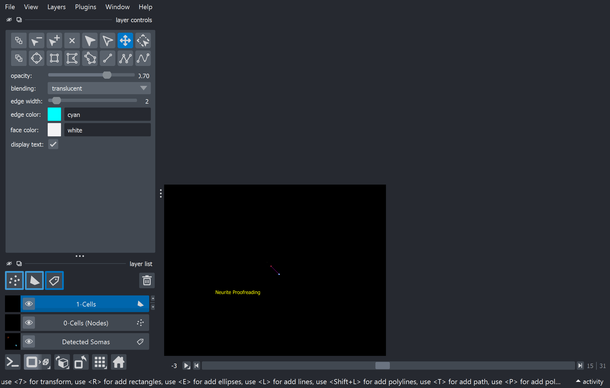
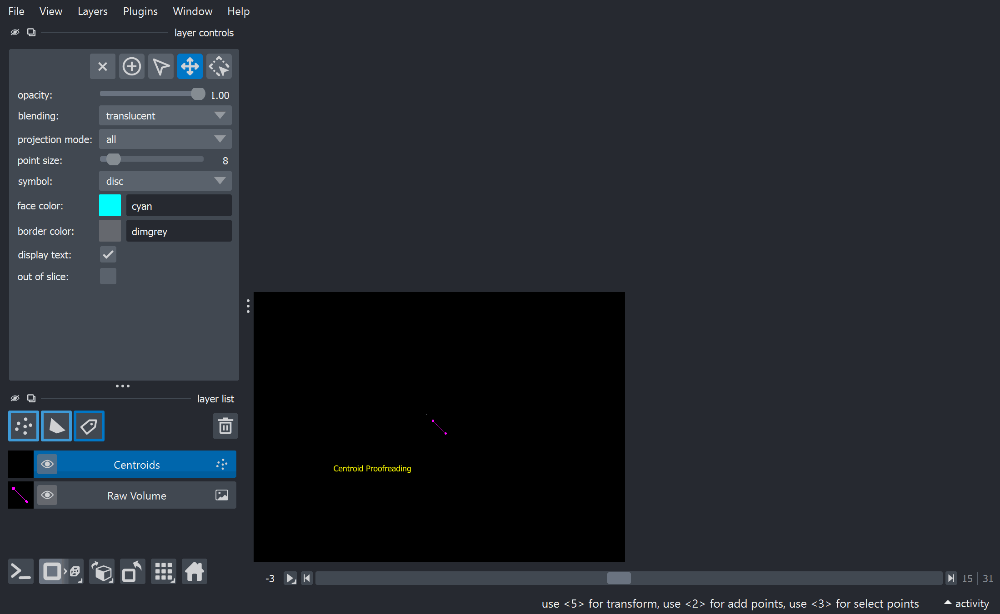

# 📖 Cloud Proofreading Portal Guide

Welcome to the Cloud Proofreading Interface! This document explains how to securely log into the cloud server and use the interactive tools to validate machine-generated biological structures.

The server now runs a **Unified Viewer** that allows you to simultaneously load, visualize, and edit both **Cell Centroids** and **Neurite Skeletons** in the same workspace. You can provide these structures in either `.swc` or `.json` (CW Complex) formats!

## 🎓 Interactive Video & Tutorial

**Watch the workflow in action!**
### 1. Neurite Editor Demo


### 2. Centroid Editor Demo


> [!TIP]
> **Try it yourself!** We have built a safe, interactive training ground using purely synthetic dummy data for you to practice without modifying real data. 
> To launch it, run the following from your terminal:
> ```bash
> cd neurite_detection
> python tutorial.py --mode neurites  # Or try: --mode centroids
> ```
> Follow the on-screen overlay instructions to learn the tools!

---

## ☁️ 1. How to Access the Cloud Portal

This portal is designed to let you perform heavy 3D rendering and structural edits directly from your web browser without installing any software. The cloud server's physical NVIDIA GPU handles all the rendering and mathematically intense operations for you.

1. **Navigate to the Portal**: Open the secure URL provided by your administrator (e.g., `https://your-server-ip.nip.io`) in Google Chrome, Firefox, or Microsoft Edge.
2. **Authentication**: This portal is protected by **Google OAuth2**. You will be redirected to a standard "Sign in with Google" page. Enter your approved Google email address and password.
3. **The Interface**: Upon successful login, you will immediately see the Napari 3D interface streaming directly in your browser.

### General Browser Navigation Controls
- **Rotate 3D**: Click and drag the left mouse button anywhere in the black canvas.
- **Pan**: Hold `Shift` + click and drag.
- **Zoom**: Scroll your mouse wheel up and down.
- **Toggle Visibility**: Click the small "Eye" icon next to any layer in the bottom-left corner to hide or show it.

---

## 🧬 2. Using the Unified Editor

Depending on what files you mounted to the cloud container, you will see Centroids, Skeletons, or both!

### Proofreading Skeletons (Edges & Nodes)
If you loaded skeletons, you are correcting the topological graph of neurite branches. 
- **0-Cells (Nodes)**: Branch points and endpoints. Select this layer to add or delete nodes.
- **Skeletons (Edges)**: Paths connecting the nodes.
- To correct a connection, select the `Skeletons (Edges)` layer, click the **Add shapes** button, and draw a new connection between two nodes.

### Proofreading Centroids (Somas)
If you loaded centroids, you are correcting basic cell-counting coordinates.
- Select the `Centroids` layer in the bottom-left panel.
- **Delete**: Click the **Select points** tool, highlight an incorrect centroid, and press `Delete`.
- **Add**: Click the **Add points** tool, click in the 3D space on the center of the cell body.

### 🚀 Saving Your Work
Once you are happy with your edits, ensure the viewer window is focused and press **`S`** on your keyboard.
- **Intensity-Based Snapping:** You do not need to trace neurites perfectly! Any hand-drawn skeleton edges and nodes will automatically snap to the mathematically brightest pixel in the local 3D neighborhood of the raw image. This ensures your trace perfectly follows the center of the fluorophore signal.
- **Format Preservation:** The unified viewer is smart. If you loaded an `.swc` file, your edits will be saved back to a strict `.swc` format (preserving node types and radiuses). If you loaded a `.json` CW-Complex, it saves back to `.json`!
